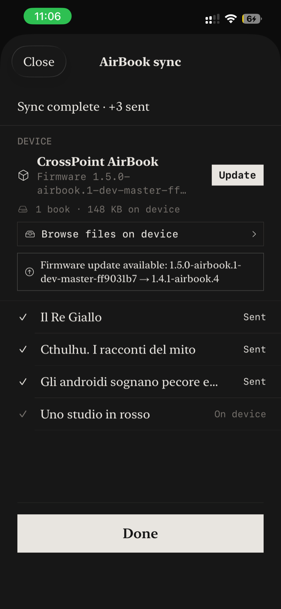
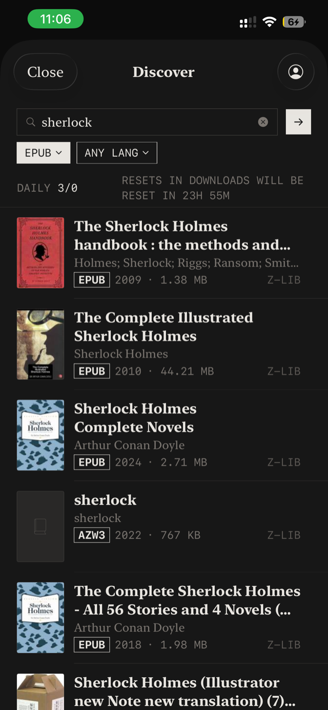
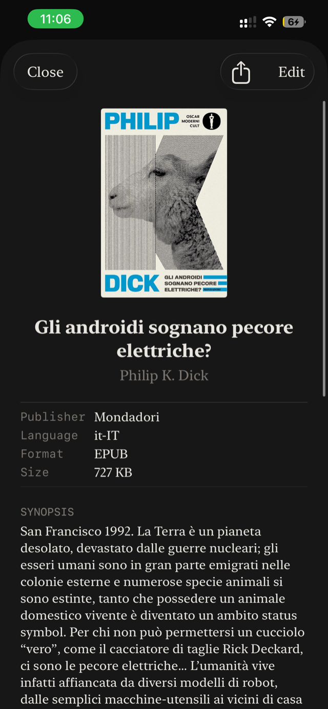
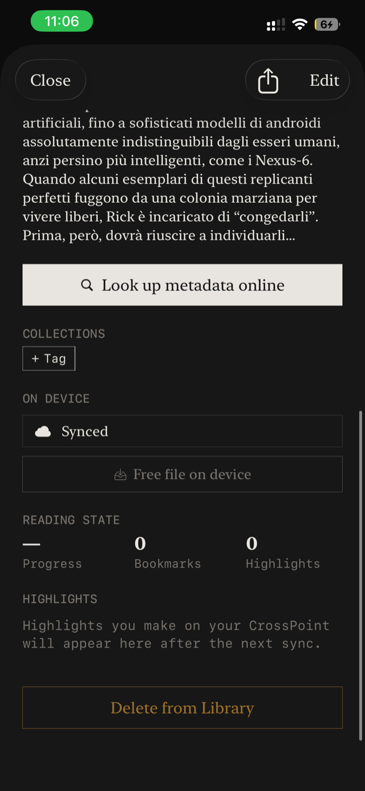
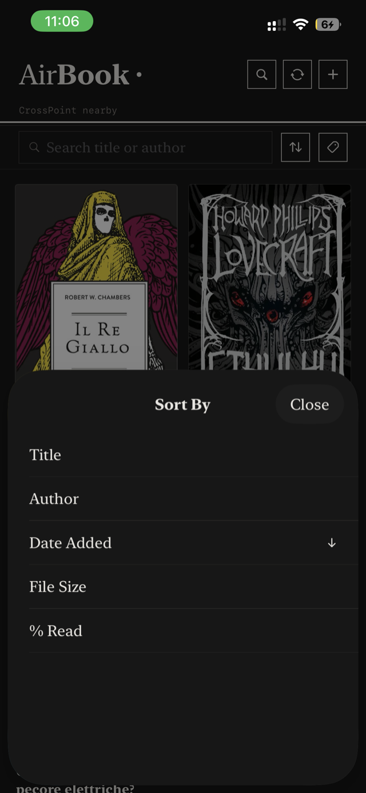

# AirBook for CrossPoint

iOS companion app for the [CrossPoint + AirBook](https://github.com/Yoddikko/crosspoint-reader) e-reader fork. Manage your library on iPhone/iPad and send books to the device over Bluetooth Low Energy.

## Features

- Library with cover art, metadata, collections and reading state
- Metadata lookup from Google Books, OpenLibrary and iTunes
- Z-Library search and download directly into the library
- Two-way BLE sync with the CrossPoint reader

## Screenshots

<table>
  <tr>
    <td align="center"> Library</td>
    <td align="center"> AirBook sync over BLE</td>
    <td align="center"> Z-Library search</td>
  </tr>
  <tr>
    <td align="center"> Book detail</td>
    <td align="center"> Sync status &amp; reading state</td>
    <td align="center"> Sort &amp; filter</td>
  </tr>
</table>

## Related

- [crosspoint-reader](https://github.com/Yoddikko/crosspoint-reader) — firmware fork the app talks to
- [crosspoint-airbook-tools](https://github.com/Yoddikko/crosspoint-airbook-tools) — web flasher

Built for iOS 26, Xcode 26.
